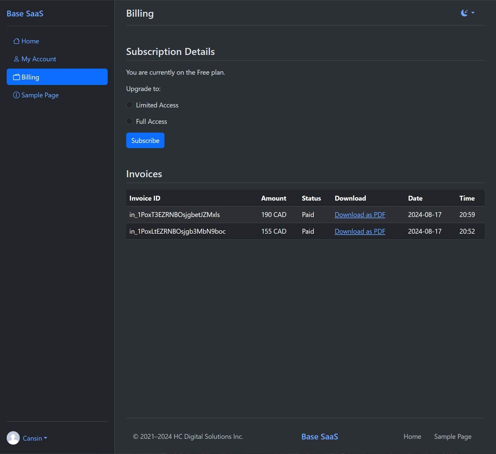
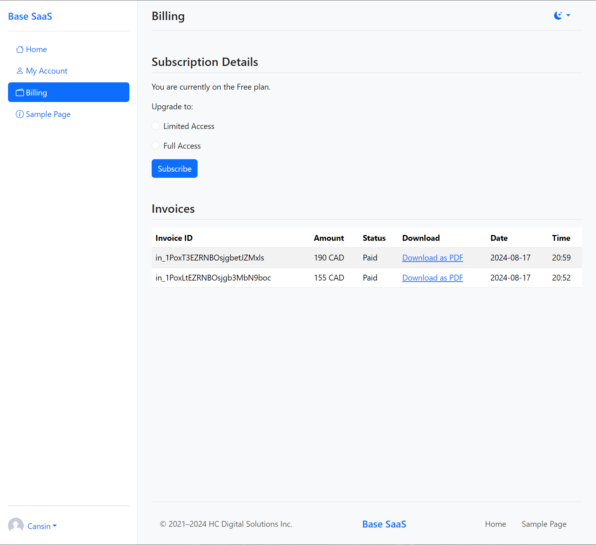
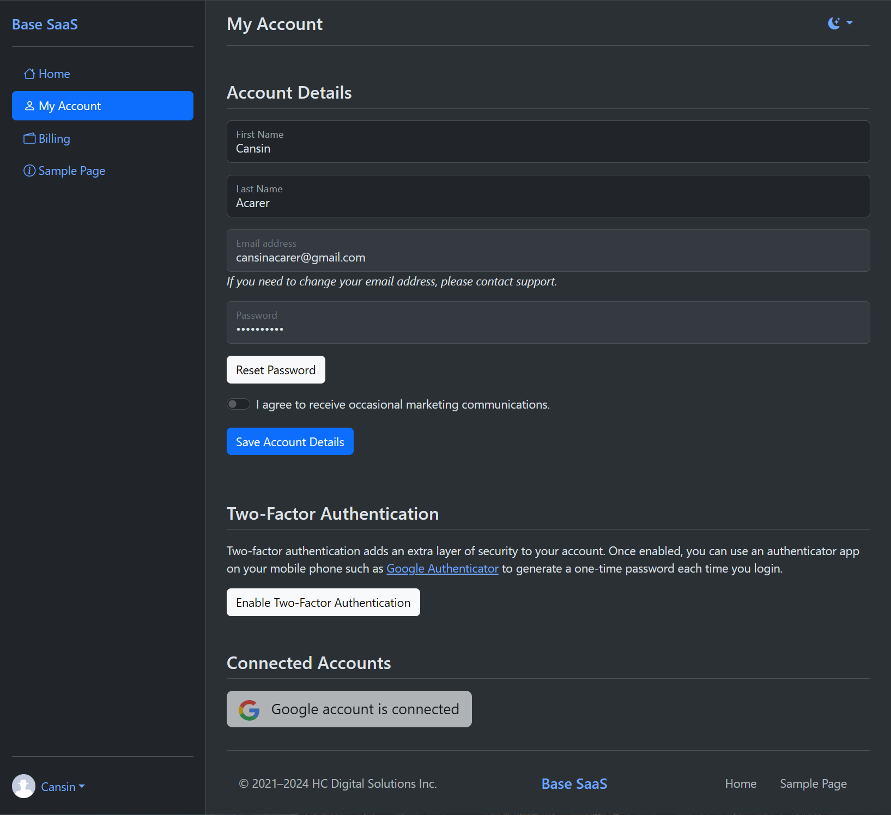
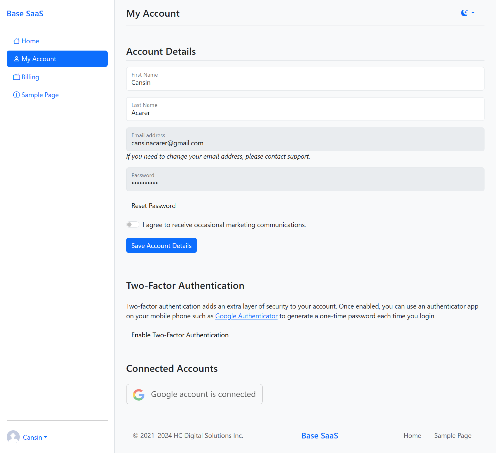
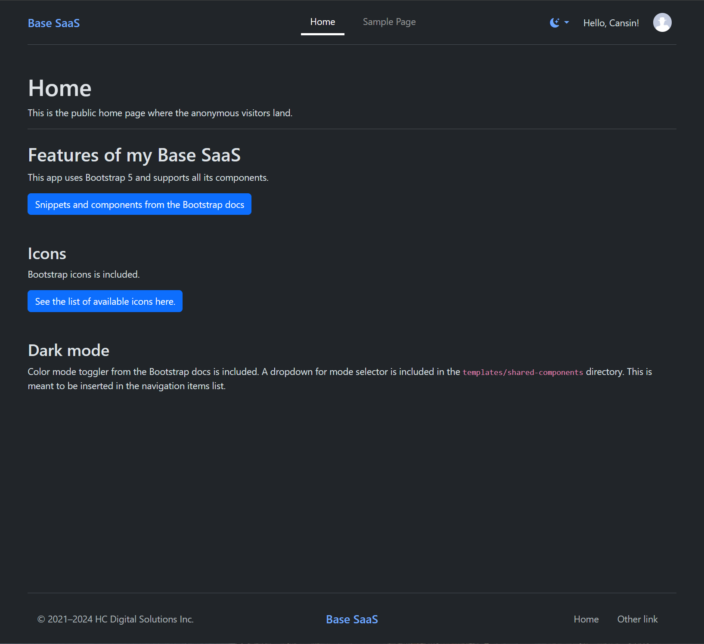
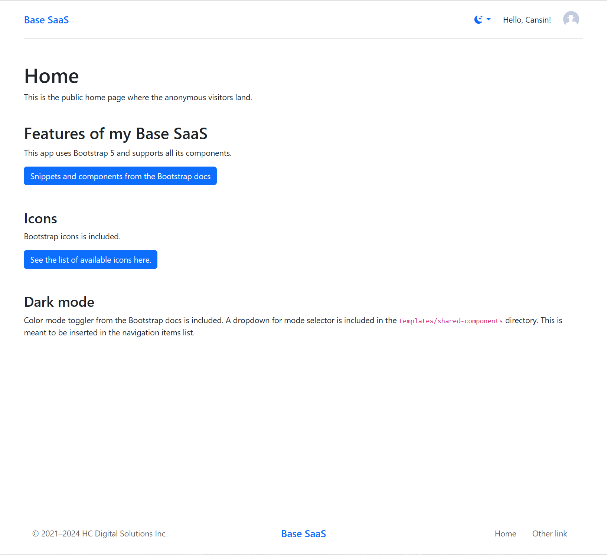

# Cansin's Base SaaS (Flask)

[](https://cansinacarer.github.io/My-Base-SaaS-Flask/)

[](https://uptime.apps.cansin.net/status/base-saas-flask-demo)

[](https://github.com/psf/black)

[](https://github.com/cansinacarer/My-Base-SaaS-Flask/actions/workflows/pre-commit.yml)
[](https://github.com/cansinacarer/My-Base-SaaS-Flask/actions/workflows/test.yml)
[](https://github.com/cansinacarer/My-Base-SaaS-Flask/actions/workflows/semantic-release.yml)
[](https://github.com/cansinacarer/My-Base-SaaS-Flask/actions/workflows/deploy.yml)
[](https://github.com/cansinacarer/My-Base-SaaS-Flask/actions/workflows/docs.yml)

[](https://codespaces.new/cansinacarer/My-Base-SaaS-Flask?devcontainer_path=.devcontainer/devcontainer.json)
[](https://stackblitz.com/github/cansinacarer/My-Base-SaaS-Flask)

The starter SaaS framework I built with Flask for my side projects with paid subscriptions.

[Live Demo](https://base-saas-flask.apps.cansin.net/) → use with [Stripe test card numbers](https://docs.stripe.com/testing?testing-method=card-numbers#cards)

## 📄 Documentation

- [Development](https://cansinacarer.github.io/My-Base-SaaS-Flask/development.html)
  - [Code Quality, Conventional Commits, and Releases](https://cansinacarer.github.io/My-Base-SaaS-Flask/development.html#code-quality-conventional-commits-and-releases)
  - [Developing in Dev Containers](https://cansinacarer.github.io/My-Base-SaaS-Flask/development.html#developing-in-dev-containers)
    - [Local Endpoints Served by the Dev Containers](https://cansinacarer.github.io/My-Base-SaaS-Flask/development.html#local-endpoints-served-by-the-dev-containers)
    - [Debugging](https://cansinacarer.github.io/My-Base-SaaS-Flask/development.html#debugging)
    - [Testing Stripe Webhooks](https://cansinacarer.github.io/My-Base-SaaS-Flask/development.html#testing-stripe-webhooks)
  - [Developing in a Virtual Environment](https://cansinacarer.github.io/My-Base-SaaS-Flask/development.html#developing-in-a-virtual-environment)
  - [Database Model](https://cansinacarer.github.io/My-Base-SaaS-Flask/development.html#database-model)
  - [How to Build On Top of This App](https://cansinacarer.github.io/My-Base-SaaS-Flask/development.html#how-to-build-on-top-of-this-app)
    - [Adding New Pages](https://cansinacarer.github.io/My-Base-SaaS-Flask/development.html#adding-new-pages)
    - [Defining More Configuration Variables](https://cansinacarer.github.io/My-Base-SaaS-Flask/development.html#defining-more-configuration-variables)
    - [Updating Dependencies](https://cansinacarer.github.io/My-Base-SaaS-Flask/development.html#updating-dependencies)
- [Continuous Integration and Continuous Deployment](https://cansinacarer.github.io/My-Base-SaaS-Flask/ci-cd.html)
  - [Pre-Commit Hooks](https://cansinacarer.github.io/My-Base-SaaS-Flask/ci-cd.html#pre-commit-hooks)
  - [Run Tests](https://cansinacarer.github.io/My-Base-SaaS-Flask/ci-cd.html#run-tests)
  - [Semantic Release](https://cansinacarer.github.io/My-Base-SaaS-Flask/ci-cd.html#semantic-release)
  - [Build & Deploy](https://cansinacarer.github.io/My-Base-SaaS-Flask/ci-cd.html#build-deploy)
  - [Build & Deploy Sphinx Docs](https://cansinacarer.github.io/My-Base-SaaS-Flask/ci-cd.html#build-deploy-sphinx-docs)
- [Deployment to Production](https://cansinacarer.github.io/My-Base-SaaS-Flask/deployment.html)
  - [A Pitfall for Cloudflare Proxy](https://cansinacarer.github.io/My-Base-SaaS-Flask/deployment.html#a-pitfall-for-cloudflare-proxy)
- [Auto Generated Documentation](https://cansinacarer.github.io/My-Base-SaaS-Flask/autoapi/index.html)

## ⭐ Features

### 🧑‍💻 Developer Experience

- Dev containers:

  - **Flask** container with pre-configured with:
    - VSCode launch.json for debugging the Flask app,
    - Prettier for HTML, CSS, and JS formatting,
    - Pre-commit hooks for code quality checks,
    - Markdownlint for Markdown formatting,
    - Black for Python code formatting,
    - Commitlint for commit message linting.

  - **Postgres** as a development database,

  - **pgAdmin** pre-connected to the development,

  - **docs** serving the built html files of the Sphinx documentation..

- CI/CD pipelines with GitHub Actions to:
  - Run pre-commit hooks,
  - Run tests,
  - Automate semantic release for versioning and changelog generation,
  - Build and deploy the documentation,
  - Build and deploy the app to production.

### ☁️ Deployment

- 🐳 Dockerized Flask for stateless continuous deployment for scalability,
- 🗄️ Database model abstracted with ORM,
- 📦 S3 object storage with pre-signed URLs.

### 💳 Stripe Integrations

- Subscriptions,
  - Different subscription tiers,
  - Billing page with Invoices,
  - Integration mechanism:
    - To begin a subscription, we send the user to Stripe with a checkout session,
    - Then listen to Stripe webhook events to process the results,
    - We set the Products in Stripe, then insert their prices into the Tiers table.

- One-off credit purchases for pre-paid metered usage.

### 🔒 Authentication

- Sign up flow,
  - Sign up with Google option,
  - Email validation requirement,

- Two factor authentication (TOTP only),
- Forgot password flow,
- reCAPTCHA v2 for sign up and login forms,
- Account details page where the user can:
  - Upload a profile picture (stored in S3),
  - Change profile details like first & last name.

### 📧 Transactional Emails with SMTP

- About Stripe subscription changes:
  - Confirmation,
  - Cancellation,
  - Expiration.

- Email verification on registration,
- Forgot password.

### 🚨 Security

- Cross-Site Request Forgery (CSRF) protection in all forms,
- Rate limiting: App-wide and form specific limits,
- Cross-Site Scripting (XSS) protection,
- Cross-Origin Resource Sharing (CORS) protection.

### 🎨 UI

#### 🔔 Notifications

- Toast notifications

```javascript
showToast(
    "This is a test toast notification!",
    "Toast Title",
    "success",
    { autohide: false }
);
```

- Modals

```javascript
showAlert(
    "Title",
    "This is a test modal dialog!",
    "Back",
    "info"
);
```

- `flash()` messages from Flask styled as Bootstrap 5 alerts,

#### 🌐 Bootstrap HTML templates

- Email templates for the email validation, password reset,
- 2 sets of page templates and Flask Blueprints:
  - Public pages (`templates/public/`),
  - Auth pages for login, sign up, and password reset, 2FA (`templates/auth/`),
  - Backend (auth required) pages (`templates/private/`).

- Utilizes the new ootb Bootstrap 5 components like floating form labels,
- Last, but not least: User configurable dark mode. 😎

## 📷 Screenshots

<table>
    <tr>
        <td colspan="2" align="center"><strong>Billing Page</strong> <code>/app/billing</code></td>
    </tr>
    <tr>
        <td></td>
        <td></td>
    </tr>
    <tr>
        <td colspan="2" align="center"><strong>My Account Page</strong> <code>/app/my-account</code></td>
    </tr>
    <tr>
        <td></td>
        <td></td>
    </tr>
    <tr>
        <td colspan="2" align="center"><strong>Public Home Page with Personalization</strong> <code>/</code></td>
    </tr>
    <tr>
        <td></td>
        <td></td>
    </tr>
</table>
