    
    

    An email validation SaaS built with microservices architecture

<!-- Links -->

    
    
    
    
    

<!-- Status -->

    
    
    
    

<!-- CI/CD -->

    
    
    
    
    

## Architecture

```mermaid
sequenceDiagram
  participant flask as 🌶️ 1. Flask Application
  participant db as 🐘 Postgres Database
  participant s3 as ☁️ S3 Bucket
  participant fis as 📁 2. File Intake Service
  participant f2vqp as 📤 3. File to Validation Queue Publisher
  participant rabbit as 🐰 RabbitMQ
  participant vo as ⚙️ 5. Validation Orchestrator
  participant evw as ✉️ 4. Email Validation Worker
  participant rfg as 📊 6. Results File Generator

  flask ->> s3: Uploads a batch validation job to validation/uploaded/
  flask ->> db: Records the job as pending_start
  s3 ->> fis: Clean up the file, calculate cost
  fis ->> db: Deduct credits from user, update status to file_accepted
  fis ->> s3: Upload cleaned file to validation/in-progress/
  s3 ->> f2vqp: Parse the cleaned file
  f2vqp ->> rabbit: Create a queue per file, publish each row as a message
  f2vqp ->> db: Update status to file_queued
  rabbit ->> vo: Consume N message per queue with Round-Robin
  vo ->> evw: API call to send each message, retrieve result
  vo ->> db: Update progress
  db ->> flask: Update progress in the UI
  vo ->> rabbit: Enqueue the results in each files' queue
  rabbit ->> rfg: Drain results queue of the file when expected message count is reached, build result file
  rfg ->> s3: Upload the result file to /validation/completed
  rfg ->> db: Set status to file_validation_in_progress or file_completed, save the name of the results file
  db ->> flask: Generate download link for results file
```

This application consists of 6 event driven services:

1. [Flask SaaS](https://github.com/cansinacarer/maillistshield-com) (this repository)
2. [File Intake Service](https://github.com/cansinacarer/maillistshield-file-intake-service)
3. [File to Validation Queue Publisher](https://github.com/cansinacarer/maillistshield-file-to-validation-queue-publisher)
4. [Email Validation Worker](https://github.com/cansinacarer/maillistshield-validation-worker)
5. [Validation Orchestrator](https://github.com/cansinacarer/maillistshield-validation-orchestrator)
6. [Results File Generator](https://github.com/cansinacarer/maillistshield-results-file-generator)

[See a more detailed architecture diagram →](https://app.diagrams.net/#Uhttps://raw.githubusercontent.com/cansinacarer/maillistshield-com/main/docs/drawio/mls-service-architecture.drawio)

## Tech Stack

| Category | Technologies |
|----------|-------------|
| **Backend** | Python, Flask |
| **Database** | PostgreSQL, SQLAlchemy ORM |
| **Message Queue** | RabbitMQ |
| **Infrastructure** | Docker, AWS S3, CapRover (PaaS deployment) |
| **Security** | OAuth 2.0, TOTP 2FA, reCAPTCHA, CSRF/XSS protection |
| **Observability** | Loki, Grafana, Uptime Kuma |
| **CI/CD** | GitHub Actions, Semantic Release |
| **Payments** | Stripe (subscriptions + one-time purchases) |

## Database Model

See the ER diagram

## Features of the Flask Application

### 🧑‍💻 Developer Experience

- Dev containers:

  - **Flask** container with pre-configured with:
    - VSCode launch.json for debugging the Flask app,
    - Prettier for HTML, CSS, and JS formatting,
    - Pre-commit hooks for code quality checks,
    - Markdownlint for Markdown formatting,
    - Black for Python code formatting,
    - Commitlint for commit message linting.

  - **Postgres** as a development database,

  - **pgAdmin** pre-connected to the development,

  - **docs** serving the built html files of the Sphinx documentation..

- CI/CD pipelines with GitHub Actions to:
  - Run pre-commit hooks,
  - Run tests,
  - Automate semantic release for versioning and changelog generation,
  - Build and deploy the documentation,
  - Build and deploy the app to production.

### ☁️ Deployment

- 🐳 Dockerized Flask for stateless continuous deployment for scalability,
- 🗄️ Database model abstracted with ORM,
- 📦 S3 object storage with pre-signed URLs.

### 💳 Stripe Integrations

- Subscriptions,
  - Different subscription tiers,
  - Billing page with Invoices,
  - Integration mechanism:
    - To begin a subscription, we send the user to Stripe with a checkout session,
    - Then listen to Stripe webhook events to process the results,
    - We set the Products in Stripe, then insert their prices into the Tiers table.

- One-off credit purchases for pre-paid metered usage.

### 🔒 Authentication

- Sign up flow,
  - Sign up with Google option,
  - Email validation requirement,

- Two factor authentication (TOTP only),
- Forgot password flow,
- reCAPTCHA v2 for sign up and login forms,
- Account details page where the user can:
  - Upload a profile picture (stored in S3),
  - Change profile details like first & last name.

### 📧 Transactional Emails with SMTP

- About Stripe subscription changes:
  - Confirmation,
  - Cancellation,
  - Expiration.

- Email verification on registration,
- Forgot password.

### 🚨 Security

- Cross-Site Request Forgery (CSRF) protection in all forms,
- Rate limiting: App-wide and form specific limits,
- Cross-Site Scripting (XSS) protection,
- Cross-Origin Resource Sharing (CORS) protection.
