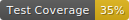

# Cansin's Base SaaS (Flask)

[](https://cansinacarer.github.io/My-Base-SaaS-Flask/)
[](https://uptime.apps.cansin.net/status/base-saas-flask-demo)


[](https://github.com/psf/black)

[](https://github.com/cansinacarer/My-Base-SaaS-Flask/actions/workflows/pre-commit.yml)
[](https://github.com/cansinacarer/My-Base-SaaS-Flask/actions/workflows/test.yml)
[](https://github.com/cansinacarer/My-Base-SaaS-Flask/actions/workflows/deploy.yml)
[](https://github.com/cansinacarer/My-Base-SaaS-Flask/actions/workflows/docs.yml)

This repository contains my 'Base SaaS', the starter SaaS framework I built for my side projects with paid subscriptions.

## Main Features

- 💳 Stripe checkout flows:
  - Subscriptions,
    - Different subscription tiers,
    - Billing page with Invoices,
    - Integration mechanism:
      - To begin a subscription, we send the user to Stripe with a checkout session,
      - Then listen to Stripe webhook events to process the results,
      - We set the Products in Stripe, then insert their prices into the Tiers table.
  - One-off credit purchases for pre-paid metered usage.
- 🔒 Authentication,
  - Sign up flow,
    - Sign up with Google option,
    - Email validation requirement,
  - Two factor authentication (TOTP only),
  - Forgot password flow,
  - Account details page where the user can:
    - Upload a profile picture (stored in S3),
    - Change profile details like first & last name.
- 📧 Transactional emails sent over SMTP:
  - About Stripe subscription changes:
    - Confirmation,
    - Cancellation,
    - Expiration.
  - Email verification on registration,
  - Forgot password.
- 🗄️ Database model with ORM, automatically created on first run to accommodate the features above,
- 🚨 Security measures:
  - CSRF (Cross-Site Request Forgery) protection in all forms,
  - Rate limiting: App-wide and form specific limits.
- 🐳 Dockerized for stateless continuous deployment,
- 🔔 UI components ready to use:
  - Toast notifications

    ```javascript
    showToast(
        "This is a test toast notification!",
        "Toast Title",
        "success",
        { autohide: false }
    );
    ```

  - Modals

    ```javascript
    showAlert(
        "Title",
        "This is a test modal dialog!",
        "Back",
        "info"
    );
    ```

  - `flash()` messages of Flask styled as Bootstrap 5 alerts,
- 🌐 HTML templates:
  - Email templates for the email validation, password reset,
  - 2 sets of page templates,
    - Public pages (`templates/public`),
      - Login/sign up pages,
    - Backend (auth required) pages (`templates/private`),
  - Utilizes the new ootb Bootstrap 5 components like floating form labels,
  - Last, but not least: User configurable dark mode. 😎

## Demo

### See my [Live Demo](https://base-saas-flask.apps.cansin.net/) with Stripe (in test mode) and Google OAuth connected

## Screenshots

<table>
    <tr>
        <td colspan="2" align="center"><strong>Billing Page</strong> <code>/app/billing</code></td>
    </tr>
    <tr>
        <td></td>
        <td></td>
    </tr>
    <tr>
        <td colspan="2" align="center"><strong>My Account Page</strong> <code>/app/my-account</code></td>
    </tr>
    <tr>
        <td></td>
        <td></td>
    </tr>
    <tr>
        <td colspan="2" align="center"><strong>Public Home Page with Personalization</strong> <code>/</code></td>
    </tr>
    <tr>
        <td></td>
        <td></td>
    </tr>
</table>

## How to Run this App in a Virtual Environment for Testing

1. Clone the repo, navigate to the repo directory,
2. Create a virtual environment: `python -m venv env`
3. Activate the virtual environment:  
   - For Windows:

     `env\Scripts\activate`
   - For macOS/Linux:

     `source env/bin/activate`
4. Install the dependencies inside the virtual environment:

   `pip install -r requirements.txt`
5. Set the environment variables listed in the `.env.template` file
6. Generate a self signed SSL certificate for using https locally. On Linux or with WSL in the root path:

   `openssl req -x509 -newkey rsa:4096 -keyout key.pem -out cert.pem -days 365 -nodes`

7. For testing with Stripe, you'll need to get the webhook secret (`whsec_...`) using this Stripe CLI command:

   `stripe listen --forward-to https://localhost:5000/app/webhook --skip-verify`

   If you want to test subscription events used by this app, run the following to make stripe CLI listen and forward the following events:
   - customer.subscription.updated
   - customer.subscription.deleted

   `stripe listen -e customer.subscription.updated,customer.subscription.deleted,checkout.session.completed --forward-to https://localhost:5000/app/webhook/stripe --skip-verify`

   This returns the webhook signing secret we use to verify that Stripe is the one sending webhook requests. This secret needs to be saved in the `.env` file as shown in `.env.template`.

8. Run `flask run`

## How to Deploy for Production

This app is containerized and intended to be deployed in a Docker container. The `Dockerfile` will install the dependencies from the `requirements.txt` in the container. Be sure to not use the debug environment variable (`FLASK_DEBUG=True`).

### Continuous Deployment

I use CapRover with the continuous deployment mechanism ~~I wrote about in [my Better Programming article here](https://betterprogramming.pub/migrate-from-heroku-to-aws-ec2-756328d8e58a)~~ I set up in [this GitHub Actions workflow](https://github.com/cansinacarer/My-Base-SaaS-Flask/actions/workflows/deploy.yml). CapRover is a self-hosted PaaS built as a layer on Docker. It simplifies setting environment variables, routing traffic to containers nginx reverse proxy, and SSL set up.

## How to Build On Top of This App

### Adding New Pages

1. In both `public` and `private` directories, you can copy the `sample-page.html` as a starter and rename it (e.g. `test.html`). The generic routing in `views.py` will automatically be served at `/test` directory.
2. Update the page title at ``.
3. Insert a link to this page in `components/header/nav-menu.html`. For the active page highlighting, we also need to update the path for active link condition in this class: `class="nav-link active"`.
4. Insert content between `` and `` as needed.

Note that URLs with trailing slashes (e.g. `/test/`) are redirected to the alternatives without one (e.g. `/test`).

### Defining More Configuration Variables

If you need to have more config variables (e.g. credentials for a new OAuth provider):

1. Define environment variables for them both in your local `.env` file and in prod,
2. In `app/config.py`, add a new attribute for the `Config` class. Use the `config` method from decouple.
3. You can then call the config value anywhere in the app as `app.config[""]`.

### Updating Dependencies

To include new Python packages, you can first install them in your local virtual environment during development. Before pushing a change with a new package, also update the dependencies using `pip freeze > requirements.txt`.

### Pitfalls

- I did not want to run this app without the configuration variables set, since many functionalities depends on them. So, most config variables do not have a default fallback. If you see the error message `Please make sure you have all the required environment variables set.` on the terminal when you try to run this app, that means you did not set all the environment variables listed in `.env.template`.
- If the domain is proxied over Cloudflare, set SSL to Full (strict) to prevent ERR_TOO_MANY_REDIRECTS error.
