# MailListShield.com SaaS

[](https://documenter.getpostman.com/view/39218943/2sB3QDxDUr)
[](https://cansinacarer.github.io/My-Base-SaaS-Flask/)
[](https://status.maillistshield.com/status/maillistshield)


[](https://github.com/psf/black)

[](https://github.com/cansinacarer/maillistshield-com/actions/workflows/deploy.yml)
[](https://github.com/cansinacarer/maillistshield-com/actions/workflows/pre-commit.yml)
[](https://github.com/cansinacarer/maillistshield-com/actions/workflows/test.yml)
[](https://github.com/cansinacarer/maillistshield-com/actions/workflows/semantic-release.yml)
[](https://github.com/cansinacarer/maillistshield-com/actions/workflows/docs.yml)

[](https://god.gw.postman.com/run-collection/39218943-677d3df8-c28c-47ad-ab45-ae21166fe426?action=collection%2Ffork&source=rip_markdown&collection-url=entityId%3D39218943-677d3df8-c28c-47ad-ab45-ae21166fe426%26entityType%3Dcollection%26workspaceId%3D0deedf09-e1c0-4689-b495-babe29e8d3c2#?env%5BMLS%20API%20Credentials%5D=W3sia2V5IjoiQVBJX0tFWSIsInZhbHVlIjoiIiwiZW5hYmxlZCI6dHJ1ZSwidHlwZSI6InNlY3JldCIsImRlc2NyaXB0aW9uIjoiVGhlIEFQSSBrZXkgeW91IHJlY2VpdmVkIG9uIHRoZSBNTFMgZGFzaGJvYXJkLiIsInNlc3Npb25WYWx1ZSI6IjEzODU3MmRmNWZjMDRmNGM4YmRjNmMwMDRlNWUzYzhmNGRjYjE3YWEwNzQyNDBiM2JmMzg4MTliNTYyNjVhNmMiLCJjb21wbGV0ZVNlc3Npb25WYWx1ZSI6IjEzODU3MmRmNWZjMDRmNGM4YmRjNmMwMDRlNWUzYzhmNGRjYjE3YWEwNzQyNDBiM2JmMzg4MTliNTYyNjVhNmMiLCJzZXNzaW9uSW5kZXgiOjB9XQ==)

## Architecture

```mermaid
sequenceDiagram
  participant flask as 🌶️ 1. Flask Application
  participant db as 🐘 Postgres Database
  participant s3 as ☁️ S3 Bucket
  participant fis as 📁 2. File Intake Service
  participant f2vqp as 📤 3. File to Validation Queue Publisher
  participant rabbit as 🐰 RabbitMQ
  participant vo as ⚙️ 5. Validation Orchestrator
  participant evw as ✉️ 4. Email Validation Worker
  participant rfg as 📊 6. Results File Generator

  flask ->> s3: Uploads a batch validation job to validation/uploaded/
  flask ->> db: Records the job as pending_start
  s3 ->> fis: Clean up the file, calculate cost
  fis ->> db: Deduct credits from user, update status to file_accepted
  fis ->> s3: Upload cleaned file to validation/in-progress/
  s3 ->> f2vqp: Parse the cleaned file
  f2vqp ->> rabbit: Create a queue per file, publish each row as a message
  f2vqp ->> db: Update status to file_queued
  rabbit ->> vo: Consume N message per queue with Round-Robin
  vo ->> evw: API call to send each message, retrieve result
  vo ->> db: Update progress
  db ->> flask: Update progress in the UI
  vo ->> rabbit: Enqueue the results in each files' queue
  rabbit ->> rfg: Drain results queue of the file when expected message count is reached, build result file
  rfg ->> s3: Upload the result file to /validation/completed
  rfg ->> db: Set status to file_validation_in_progress or file_completed, save the name of the results file
  db ->> flask: Generate download link for results file
```



This application consists of 6 event driven services:

1. [Flask SaaS](https://github.com/cansinacarer/maillistshield-com) (this repository)
2. [File Intake Service](https://github.com/cansinacarer/maillistshield-file-intake-service)
3. [File to Validation Queue Publisher](https://github.com/cansinacarer/maillistshield-file-to-validation-queue-publisher)
4. [Email Validation Worker](https://github.com/cansinacarer/maillistshield-validation-worker)
5. [Validation Orchestrator](https://github.com/cansinacarer/maillistshield-validation-orchestrator)
6. [Results File Generator](https://github.com/cansinacarer/maillistshield-results-file-generator)

### Tech Stack

The services are triggered by:

- Messages on a __RabbitMQ__ server on designated vhosts,
- Files created at an __AWS S3__ compatible object storage service, at designated directories.

All services share a common __Postgres__ database, and configured to send logs to a __Loki__ server.

See [this drawio diagram](docs/drawio/mls-service-architecture.drawio) for a more detailed description of the interactions between these services.

## Service Descriptions

### 1. [Flask SaaS](https://github.com/cansinacarer/maillistshield-com)

This is the Flask application served at [maillistshield.com](https://maillistshield.com/).

#### Features

##### 🧑‍💻 Developer Experience

- Dev containers:

  - __Flask__ container with pre-configured with:
    - VSCode launch.json for debugging the Flask app,
    - Prettier for HTML, CSS, and JS formatting,
    - Pre-commit hooks for code quality checks,
    - Markdownlint for Markdown formatting,
    - Black for Python code formatting,
    - Commitlint for commit message linting.

  - __Postgres__ as a development database,

  - __pgAdmin__ pre-connected to the development,

  - __docs__ serving the built html files of the Sphinx documentation..

- CI/CD pipelines with GitHub Actions to:
  - Run pre-commit hooks,
  - Run tests,
  - Automate semantic release for versioning and changelog generation,
  - Build and deploy the documentation,
  - Build and deploy the app to production.

##### ☁️ Deployment

- 🐳 Dockerized Flask for stateless continuous deployment for scalability,
- 🗄️ Database model abstracted with ORM,
- 📦 S3 object storage with pre-signed URLs.

##### 💳 Stripe Integrations

- Subscriptions,
  - Different subscription tiers,
  - Billing page with Invoices,
  - Integration mechanism:
    - To begin a subscription, we send the user to Stripe with a checkout session,
    - Then listen to Stripe webhook events to process the results,
    - We set the Products in Stripe, then insert their prices into the Tiers table.

- One-off credit purchases for pre-paid metered usage.

##### 🔒 Authentication

- Sign up flow,
  - Sign up with Google option,
  - Email validation requirement,

- Two factor authentication (TOTP only),
- Forgot password flow,
- reCAPTCHA v2 for sign up and login forms,
- Account details page where the user can:
  - Upload a profile picture (stored in S3),
  - Change profile details like first & last name.

##### 📧 Transactional Emails with SMTP

- About Stripe subscription changes:
  - Confirmation,
  - Cancellation,
  - Expiration.

- Email verification on registration,
- Forgot password.

##### 🚨 Security

- Cross-Site Request Forgery (CSRF) protection in all forms,
- Rate limiting: App-wide and form specific limits,
- Cross-Site Scripting (XSS) protection,
- Cross-Origin Resource Sharing (CORS) protection.

#### My Base SaaS

This project uses my [my base saas](https://github.com/cansinacarer/my-base-saas-flask) as an upstream repository. When I build a feature that is generally applicable and not specific to MailListShield, I build it in my base saas and pull them into this repository.

To pull updates from my base saas, connect it as an upstream:

```sh
git remote add upstream https://github.com/cansinacarer/my-base-saas-flask
```

Then you can fetch and merge:

```sh
git fetch upstream
git merge upstream/main
```

#### 📄 Developer Documentation

- [Development](https://cansinacarer.github.io/My-Base-SaaS-Flask/development.html)
  - [Code Quality, Conventional Commits, and Releases](https://cansinacarer.github.io/My-Base-SaaS-Flask/development.html#code-quality-conventional-commits-and-releases)
  - [Developing in Dev Containers](https://cansinacarer.github.io/My-Base-SaaS-Flask/development.html#developing-in-dev-containers)
    - [Local Endpoints Served by the Dev Containers](https://cansinacarer.github.io/My-Base-SaaS-Flask/development.html#local-endpoints-served-by-the-dev-containers)
    - [Debugging](https://cansinacarer.github.io/My-Base-SaaS-Flask/development.html#debugging)
    - [Testing Stripe Webhooks](https://cansinacarer.github.io/My-Base-SaaS-Flask/development.html#testing-stripe-webhooks)
  - [Developing in a Virtual Environment](https://cansinacarer.github.io/My-Base-SaaS-Flask/development.html#developing-in-a-virtual-environment)
  - [Database Model](https://cansinacarer.github.io/My-Base-SaaS-Flask/development.html#database-model)
  - [How to Build On Top of This App](https://cansinacarer.github.io/My-Base-SaaS-Flask/development.html#how-to-build-on-top-of-this-app)
    - [Adding New Pages](https://cansinacarer.github.io/My-Base-SaaS-Flask/development.html#adding-new-pages)
    - [Defining More Configuration Variables](https://cansinacarer.github.io/My-Base-SaaS-Flask/development.html#defining-more-configuration-variables)
    - [Updating Dependencies](https://cansinacarer.github.io/My-Base-SaaS-Flask/development.html#updating-dependencies)
- [Continuous Integration and Continuous Deployment](https://cansinacarer.github.io/My-Base-SaaS-Flask/ci-cd.html)
  - [Pre-Commit Hooks](https://cansinacarer.github.io/My-Base-SaaS-Flask/ci-cd.html#pre-commit-hooks)
  - [Run Tests](https://cansinacarer.github.io/My-Base-SaaS-Flask/ci-cd.html#run-tests)
  - [Semantic Release](https://cansinacarer.github.io/My-Base-SaaS-Flask/ci-cd.html#semantic-release)
  - [Build & Deploy](https://cansinacarer.github.io/My-Base-SaaS-Flask/ci-cd.html#build-deploy)
  - [Build & Deploy Sphinx Docs](https://cansinacarer.github.io/My-Base-SaaS-Flask/ci-cd.html#build-deploy-sphinx-docs)
- [Deployment to Production](https://cansinacarer.github.io/My-Base-SaaS-Flask/deployment.html)
  - [A Pitfall for Cloudflare Proxy](https://cansinacarer.github.io/My-Base-SaaS-Flask/deployment.html#a-pitfall-for-cloudflare-proxy)
- [Auto Generated Documentation](https://cansinacarer.github.io/My-Base-SaaS-Flask/autoapi/index.html)

### 2. [File Intake Service](https://github.com/cansinacarer/maillistshield-file-intake-service)

This microservice runs a monitoring loop to check the `/validation/uploaded` directory on the S3 bucket and the `Jobs` table in the database for matching job records.

When a new file and a corresponding job is found, this service performs the following tasks:

- Remove all columns except email,
- Remove empty rows,
- Rename the email column as "Email",
- Count the rows and record it into the job record in the database,
- Deduct credits based on the record count in the cleaned up file,
- Create a standardized version of the file in `/validation/in-progress` in the S3 bucket.

This loop can be paused by setting an environment variable: `PAUSE=True`.

__Job States:__

- Expected before:
  - `pending_start`
- Error states
  - `error_too_old` : file deleted because it has been here too long
  - `error_df` : file could not be read
  - `error_column_count` : user did not select a column name but we detect more than 1 column
  - `error_insufficient_credits` :  User didn't have enough credits to process the file.
- Success state:
  - `file_accepted`

#### Clean up of orphan files

If a file is found but a corresponding job is not found, there is a retention period to allow for delays in database update. This retention period is declared in seconds with the environment variable `RETENTION_PERIOD_FOR_ORPHAN_FILES`. If there is no job record found in the database for a file found on the S3 bucket at the end of the retention period, the file is deleted.

### 3. [File to Validation Queue Publisher](https://github.com/cansinacarer/maillistshield-file-to-validation-queue-publisher)

This microservice monitors the S3 bucket for cleaned, standardized files. When a file is found, its rows are queued in a RabbitMQ Queue at `RABBITMQ_DEFAULT_VHOSTS[0]`. The queued files are moved to `validation/queued`.

__Job States:__

- Expected before:
  - `file_accepted`
- Error states
  - `error_?`
- Success state:
  - `file_queued`

### 4. [Email Validation Worker](https://github.com/cansinacarer/maillistshield-validation-worker)

This service performs the email validation. It takes API requests with an API key and responds with the validation result JSON shown on the SaaS home page.

#### Deployment note for the validation worker

This service should be deployed in multiple servers in different IP blocks (preferably in different regions) because the success of the validation depends on the IP reputation determined by the email service providers. A worker in one server might return an unknown result while another instance that is deployed on a server with a different IP reputation can find a valid result.

The other services that use this worker can try multiple workers and use the best result.

__Job States:__

This service does not change the job state, because it only works with individual email addresses and is unaware of files.

### 5. [Validation Orchestrator](https://github.com/cansinacarer/maillistshield-validation-orchestrator)

This service monitors the results queues at vhost `RABBITMQ_DEFAULT_VHOSTS[1]` and when a queue at this vhost has the expected number of messages (i.e. `row_count` attribute of the queue), the messages from this queue are consumed and bundled into a final results file.

__Job States:__

This service does not change the job state in the database. The progress of a file is tracked using the number of messages in the queue for that file at vhost `RABBITMQ_DEFAULT_VHOSTS[1]`.

### 6. [Results File Generator](https://github.com/cansinacarer/maillistshield-results-file-generator)

This service monitors the results queues at vhost `RABBITMQ_DEFAULT_VHOSTS[1]` and when a queue at this vhost has the expected number of messages (i.e. `row_count` attribute of the queue), the messages from this queue are consumed and bundled into a final results file.

Tasks of this service include the following:

- List all the queues and their message
  - If a queue has as many messages as its row_count, process it:
    - Create the output file,
    - Update in database:
      - Status
      - Results file
    - Delete the queue
  - Else, update `last_pick_row` in the `BatchJobs` table with message count.

__Job States:__

- Expected before:
  - `file_queued`
- Progress while the file rows have begun being processed
  - `file_validation_in_progress`
- Error states
  - `error_?`
- Success state:
  - `file_completed`

---

### [Initial Tests & Notes](https://github.com/cansinacarer/email-verification-test)

### [File Processor OLD](https://github.com/cansinacarer/maillistshield-scheduler)
